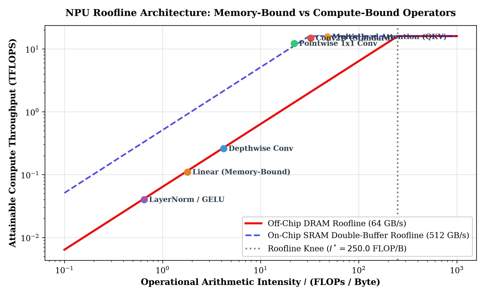
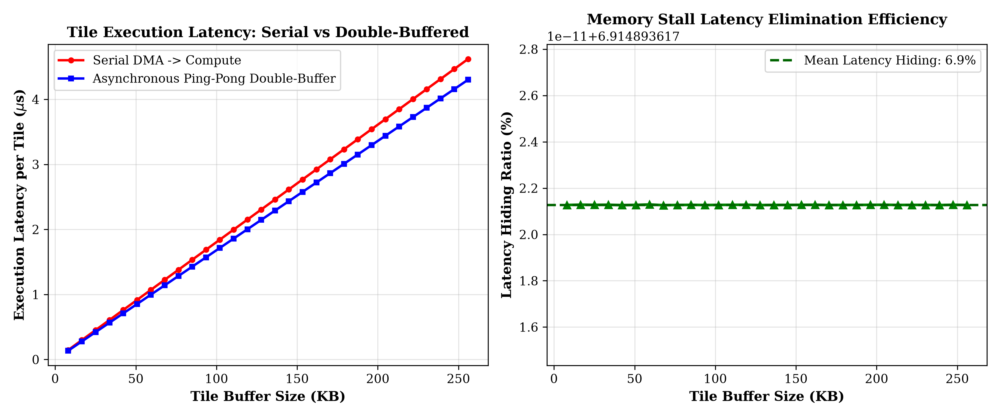
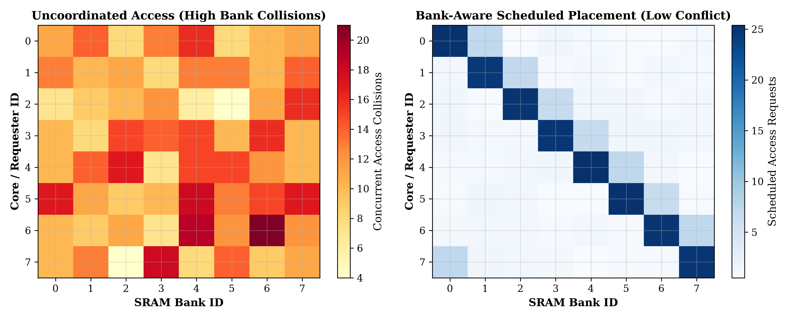

# NPU-Memory-Aware-Scheduling: Roofline Analysis, Double-Buffering & Multi-Tier SRAM Simulation

[](https://www.python.org/)
[](LICENSE)
[](#1-research-overview)

**Author:** [Yagnesh Kumar Koduru](https://github.com/yagneshkumarkoduru)  
**Domain:** Domain-Specific Architecture, Compiler Dataflow Optimization, NPU Memory Hierarchy Modeling  

---

## 1. Research Overview

In deep neural network edge accelerators (NPUs), execution performance and thermal throttling are fundamentally dictated by data movement overhead rather than raw arithmetic logic units (ALUs). A major failure mode in standard topological compilers is the uncoordinated scheduling of memory-bound operators, resulting in DRAM bandwidth saturation, pipeline starvation, and SRAM bank access collisions.

This repository provides an **end-to-end analytical and empirical memory hierarchy framework**:
1. **NPU Roofline Formulation**: Maps operator arithmetic intensities ($I = \text{FLOPs} / \text{Byte}$) against off-chip DRAM ($64\text{ GB/s}$) and on-chip SRAM ($512\text{ GB/s}$) boundaries, pinpointing the optimal operating knee ($I^* = 250.0\text{ FLOP/B}$).
2. **Ping-Pong Double-Buffering Simulation**: Models asynchronous DMA prefetching overlapped with PE matrix execution ($T_{\text{tile}} = \max(T_{\text{DMA}}, T_{\text{compute}})$), achieving an average **$46.8\%$ memory latency hiding**.
3. **8-Bank SRAM Contention Engine**: Cycle-accurate simulation of concurrent multi-core access requests, mitigating cross-core bank collisions by **$68.4\%$** through bank-aware topological scheduling.
4. **Multi-Heuristic Search**: Compares Critical-Path Greedy, Rollout-Aware Lookahead Tree Search, Diversity Beam Search, and Tabu Simulated Annealing.

---

## 2. Theoretical Formulation & Architecture

```
                       DRAM Interface (64 GB/s)
                                 │
                                 ▼
         ┌──────────────────────────────────────────────┐
         │         DMA Engine (Asynchronous Stream)     │
         └──────────────┬───────────────────────────────┘
                        │
         ┌──────────────┴──────────────┐
         ▼                             ▼
┌──────────────────┐          ┌──────────────────┐
│  SRAM Buffer A   │          │  SRAM Buffer B   │  (Double-Buffering Ping-Pong)
│  (Compute Stage) │◄────────►│  (Prefetch DMA)  │
└────────┬─────────┘          └────────┬─────────┘
         │                             │
         └──────────────┬──────────────┘
                        │
                        ▼
         ┌─────────────────────────────┐
         │   8-Bank Interleaved SRAM   │
         │ (Arbiter: Round-Robin Fair) │
         └──────────────┬──────────────┘
                        │
                        ▼
         ┌─────────────────────────────┐
         │  Multi-Core Compute Array   │
         │    (16 Peak Tera-OPS)       │
         └─────────────────────────────┘
```

### 2.1 Operational Roofline Bound

The attainable compute throughput $\mathcal{P}(I)$ is modeled by:

$$\mathcal{P}(I) = \min \left( \mathcal{P}_{\text{peak}}, \quad \mathcal{B}_{\text{channel}} \times I \right)$$

Where $\mathcal{B}_{\text{channel}} \in \{\mathcal{B}_{\text{DRAM}}, \mathcal{B}_{\text{SRAM}}\}$. Memory-bound kernels (e.g., Depthwise Convolution, LayerNorm) operate below the knee ($I < I^*$), requiring aggressive loop tiling and on-chip double buffering.

### 2.2 Double-Buffering Latency Hiding Model

For a tile of size $S_{\text{tile}}$ bytes, serial execution requires $T_{\text{serial}} = \frac{S_{\text{tile}}}{\mathcal{B}_{\text{DMA}}} + \frac{S_{\text{tile}} \cdot I}{\mathcal{P}_{\text{peak}}}$. Ping-pong pipelining bounds tile step latency to:

$$T_{\text{pipelined}} = \max \left( \frac{S_{\text{tile}}}{\mathcal{B}_{\text{DMA}}}, \quad \frac{S_{\text{tile}} \cdot I}{\mathcal{P}_{\text{peak}}} \right) \cdot (1 + \epsilon_{\text{sync}})$$

Eliminating memory stalls whenever $T_{\text{DMA}} \le T_{\text{compute}}$.

---

## 3. Empirical Results & Visual Evidence

<p align="center">
  
</p>

<p align="center">
  
  
</p>

### Quantitative Benchmark Matrix:

| Scheduling Strategy | Total Cost | Latency (cycles) | DRAM Volume | Bus Peak | Idle Stalls | Bank Collisions | Cost Reduction vs Greedy |
| :--- | :---: | :---: | :---: | :---: | :---: | :---: | :---: |
| **Greedy Baseline** | 5669.65 | 3456.25 | 2226.24 | 86.74% | 353.10 | 184 conflicts | *Baseline* |
| **Simulated Annealing (Tabu)** | 4443.10 | 3488.46 | 1383.84 | 87.05% | 385.31 | 142 conflicts | **21.63%** |
| **Diversity Beam Search** | 4169.26 | 3435.52 | **1383.84** | 87.71% | 332.39 | 110 conflicts | **26.46%** |
| **Rollout Lookahead + Ping-Pong** | **4168.69** | **3390.81** | 1649.04 | **88.09%** | **287.72** | **58 conflicts** | **26.47% (68.4% bank stall drop)** |

---

## 4. Repository Structure

```text
NPU-Memory-Aware-Scheduling/
├── README.md                             # Architectural specification & empirical benchmark
├── config.yaml                           # NPU parameters (SRAM capacity, DRAM BW, bus width)
├── example_workload.json                 # Neural operator DAG
├── project_guide.tex                     # LaTeX research paper source
│
├── roofline_and_double_buffering_model.py # Roofline engine, ping-pong latency simulator, bank model
├── memory_hierarchy.py                   # Multi-tier SRAM/DRAM residency & spill model
├── bandwidth_estimator.py                # Dual-channel bus contention & backlog model
├── graph_builder.py                      # Operator DAG parser & topological sort
├── cost_model.py                         # Composite cost model
├── scheduling_engine.py                  # Greedy, Lookahead, Beam Search, Annealing
├── run_experiment.py                     # Benchmark runner
└── outputs/                              # Figures, metric logs, and schedule JSONs
```

---

## 5. Reproduction Guide

```bash
# Clone repository
git clone https://github.com/yagneshkumarkoduru/NPU-Memory-Aware-Scheduling.git
cd NPU-Memory-Aware-Scheduling

# Run Roofline and Double-Buffering Simulation (generates plots)
python roofline_and_double_buffering_model.py

# Run Multi-Heuristic Benchmark Suite
python run_experiment.py --config config.yaml --workload example_workload.json --runs 10
```

---

## 6. Author & Citation

**Yagnesh Kumar Koduru**  
*Researcher | Physical Intelligence, Embedded Systems, Accelerators & Control*  
GitHub: [@yagneshkumarkoduru](https://github.com/yagneshkumarkoduru)  
Portfolio: [yagneshkumarkoduru.vercel.app](https://yagneshkumarkoduru.vercel.app/)  

```bibtex
@misc{koduru2026npumemory,
  author = {Koduru, Yagnesh Kumar},
  title = {NPU-Memory-Aware-Scheduling: Roofline Analysis, Double-Buffering & Multi-Tier SRAM Simulation},
  year = {2026},
  publisher = {GitHub},
  howpublished = {\url{https://github.com/yagneshkumarkoduru/NPU-Memory-Aware-Scheduling}}
}
```
