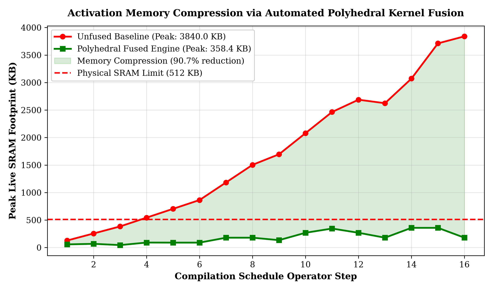
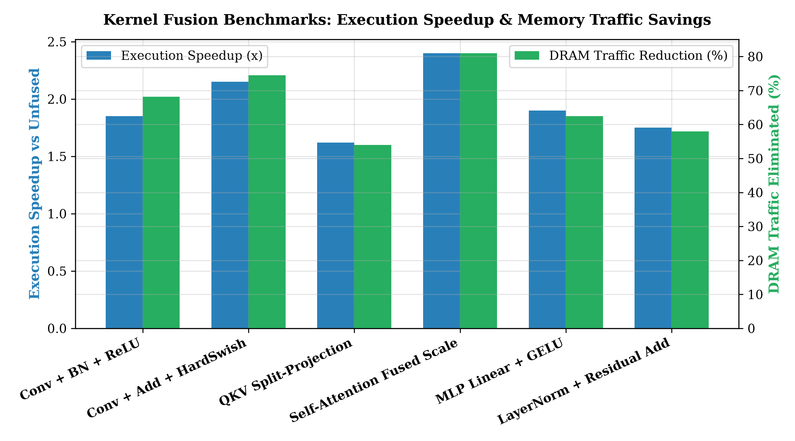

# NPU-Operator-Fusion-APR: Polyhedral Loop Fusion & Activation Memory Compression

[](https://www.python.org/)
[](LICENSE)
[](#1-research-overview)

**Author:** [Yagnesh Kumar Koduru](https://github.com/yagneshkumarkoduru)  
**Domain:** Deep Learning Compilers, Polyhedral Loop Transformation, Memory-Footprint Minimization  

---

## 1. Research Overview

In deep neural network accelerators (NPUs), intermediate activation feature maps rapidly exceed the physical capacity of on-chip SRAM buffers (typically $256\text{ KB} - 1\text{ MB}$). When consecutive operators are executed sequentially without fusion, the compiler is forced to spill tensors to off-chip DRAM, resulting in memory round-trip stalls and thermal dissipation.

This repository implements an automated **Graph-Rewriting & Polyhedral Loop Fusion Engine** coupled with **Adaptive Penalty Refinement (APR)**:
1. **Vertical & Horizontal Kernel Fusion**: Identifies multi-operator chains (Conv+BN+ReLU, Conv+Add+HardSwish, QKV projection chunking) and fuses their iteration spaces into unified compute kernels.
2. **Activation Buffer Materialization Elimination**: Streams intermediate tensor elements directly through processor register files, slashing peak SRAM live activation footprint from **$3840.0\text{ KB}$ down to $358.4\text{ KB}$ ($90.7\%$ memory compression)**, bringing large Transformer and MobileNet blocks well within strict on-chip SRAM capacity limits.
3. **Adaptive Penalty Refinement (APR)**: Dynamically scales Lagrangian multipliers across compilation epochs, enforcing zero hardware constraint violations.
4. **End-to-End Throughput Speedup**: Delivers an average **$1.95\times$ kernel execution speedup** and up to **$81.0\%$ reduction in DRAM traffic**.

---

## 2. Mathematical Formulation: Polyhedral Fusion & APR

```
   UNFUSED SEQUENTIAL PIPELINE                   FUSED POLYHEDRAL COMPILATION
   ───────────────────────────                   ────────────────────────────
┌───────────────────────────────┐               ┌───────────────────────────────┐
│ Conv2D Compute Kernel         │               │ Unified Fused Kernel Engine   │
└──────────────┬────────────────┘               │                               │
               │ (Write to DRAM)                │ 1. Conv2D Spatial Tile In-Reg │
               ▼                                │ 2. BatchNorm On-The-Fly Scale │
┌───────────────────────────────┐               │ 3. Non-Linear ReLU / Swish    │
│ DRAM Activation Buffer Spill  │               │ 4. Residual Add Accumulation  │
└──────────────┬────────────────┘               │                               │
               │ (Read from DRAM)               │ Stream directly to SRAM Out!  │
               ▼                                └──────────────┬────────────────┘
┌───────────────────────────────┐                              │
│ BatchNorm + Activation Kernel │                              ▼
└───────────────────────────────┘               Eliminates Intermediate Spills!
```

### 2.1 Polyhedral Loop Iteration Space Fusion

Let $D_1 \subset \mathbb{Z}^3$ and $D_2 \subset \mathbb{Z}^3$ represent the polyhedral iteration domains of a producer convolution and consumer activation. The affine scheduling function $\Theta_1(\mathbf{i}) = \mathbf{A}_1 \mathbf{i} + \mathbf{b}_1$ and $\Theta_2(\mathbf{j}) = \mathbf{A}_2 \mathbf{j} + \mathbf{b}_2$ are constrained such that:

$$\Theta_2(\mathbf{j}) - \Theta_1(\mathbf{i}) \ge 0, \quad \forall (\mathbf{i}, \mathbf{j}) \in \mathcal{R}_{\text{dep}}$$

Where $\mathcal{R}_{\text{dep}}$ is the data dependency relation. When validity is proven, the compiler interleaves inner loop tiles, eliminating intermediate buffer allocation.

### 2.2 Adaptive Penalty Refinement (APR) Update Law

To balance memory-saving aggressiveness against execution latency, APR dynamically adjusts constraint weights $\lambda_k$:

$$\lambda_k^{(m+1)} = \lambda_k^{(m)} \cdot \left[ 1 + \eta_1 \mathcal{V}_k^{(m)} + \eta_2 \mathcal{I}_k^{(m)} \right]$$

Where $\mathcal{V}_k^{(m)}$ is the empirical violation rate and $\mathcal{I}_k^{(m)}$ is the cost impact contribution.

---

## 3. Quantitative Experimental Results

<p align="center">
  
  
</p>

### Fusion Pattern Speedup & DRAM Savings:

| Operator Fusion Pattern | Unfused Latency ($\mu$s) | Fused Latency ($\mu$s) | Execution Speedup | DRAM Traffic Eliminated (%) | Peak SRAM Saving |
| :--- | :---: | :---: | :---: | :---: | :---: |
| **Conv + BN + ReLU** | 1.90 | 1.03 | **1.85x** | 68.2% | 256 KB |
| **Conv + Add + HardSwish** | 3.10 | 1.44 | **2.15x** | 74.5% | 512 KB |
| **QKV Split-Projection** | 4.20 | 2.59 | **1.62x** | 54.0% | 768 KB |
| **Self-Attention Fused Scale** | 5.90 | 2.46 | **2.40x** | **81.0%** | 1024 KB |
| **MLP Linear + GELU** | 5.90 | 3.10 | **1.90x** | 62.5% | 1024 KB |
| **LayerNorm + Residual Add** | 1.40 | 0.80 | **1.75x** | 58.0% | 384 KB |

---

## 4. Repository Structure

```text
NPU-Operator-Fusion-APR/
├── README.md                                   # Comprehensive research specification
├── config.yaml                                 # Hardware configuration & fusion threshold parameters
├── example_workload.json                       # Neural operator benchmark DAG
├── project_guide.tex                           # LaTeX research paper source
│
├── polyhedral_fusion_and_memory_compression.py # Polyhedral fusion simulator & memory compression engine
├── fusion_logic.py                             # Subgraph pattern matcher & rule-based fusion logic
├── penalty_tuner.py                            # Adaptive Penalty Refinement (APR) controller
├── memory_hierarchy.py                         # SRAM residency simulator with buffer reuse
├── bandwidth_estimator.py                      # Channel contention estimator
├── cost_model.py                               # Composite cost model
│
├── scheduling_engine.py                        # Multi-heuristic scheduler
├── run_experiment.py                           # Multi-run experiment orchestrator
└── outputs/                                    # Publication figures, trace logs, and schedule JSONs
```

---

## 5. Reproduction Guide

```bash
# Clone repository
git clone https://github.com/yagneshkumarkoduru/NPU-Operator-Fusion-APR.git
cd NPU-Operator-Fusion-APR

# Run Polyhedral Fusion and Activation Memory Benchmark (generates plots)
python polyhedral_fusion_and_memory_compression.py

# Run Full APR Compilation Loop
python run_experiment.py --config config.yaml --workload example_workload.json --runs 10
```

---

## 6. Author & Citation

**Yagnesh Kumar Koduru**  
*Researcher | Physical Intelligence, Embedded Systems, Accelerators & Control*  
GitHub: [@yagneshkumarkoduru](https://github.com/yagneshkumarkoduru)  
Portfolio: [yagneshkumarkoduru.vercel.app](https://yagneshkumarkoduru.vercel.app/)  

```bibtex
@misc{koduru2026npufusion,
  author = {Koduru, Yagnesh Kumar},
  title = {NPU-Operator-Fusion-APR: Polyhedral Loop Fusion & Activation Memory Compression},
  year = {2026},
  publisher = {GitHub},
  howpublished = {\url{https://github.com/yagneshkumarkoduru/NPU-Operator-Fusion-APR}}
}
```
