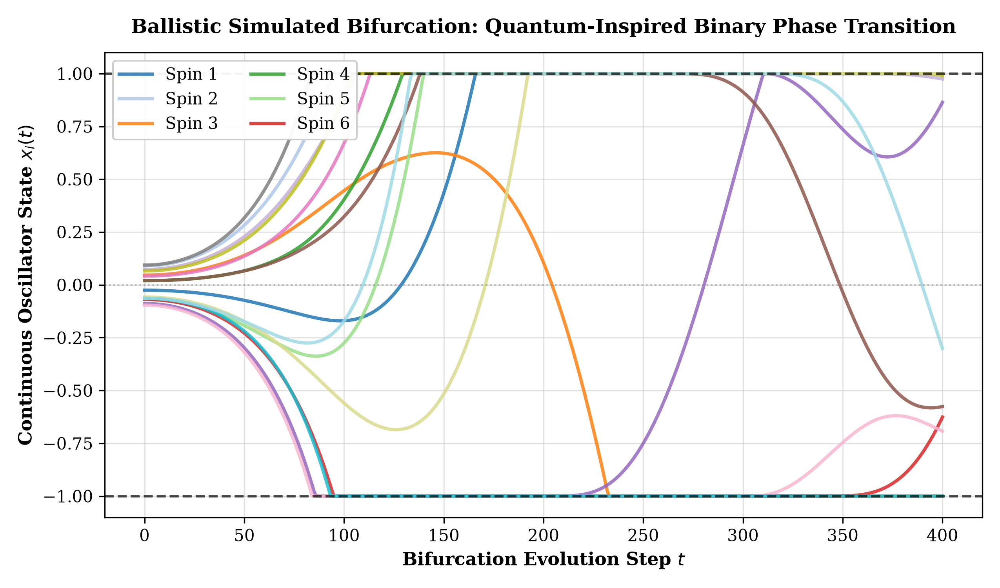
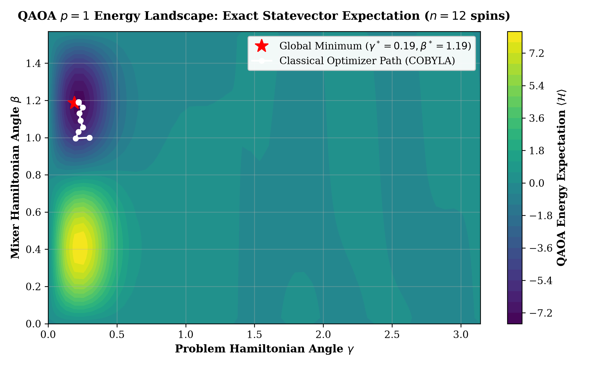

# Quantum-QUBO-NPU-Optimization: Simulated Bifurcation & QAOA Variational Solvers

[](https://www.python.org/)
[](https://qiskit.org/)
[](LICENSE)
[](#1-research-overview)

**Author:** [Yagnesh Kumar Koduru](https://github.com/yagneshkumarkoduru)  
**Domain:** Quantum Computing, Non-Linear Hamiltonian Dynamics, Combinatorial Optimization, NPU Accelerators  

---

## 1. Research Overview

Scheduling deep neural network execution graphs onto heterogeneous multi-core NPUs under hard SRAM capacity and bus contention constraints maps directly to NP-hard Quadratic Unconstrained Binary Optimization (QUBO). Classical combinatorial solvers suffer from exponential runtime scaling as graph cardinality grows beyond $50$ nodes.

This repository formulates a **quantum-classical hybrid compilation and optimization framework**:
1. **Coupled Ising Energy Hamiltonian Formulation**: Maps operator topological placement variables $x_{i,t} \in \{0, 1\}$ into an Ising-equivalent spin Hamiltonian capturing unary execution costs, pairwise tensor data-reuse rewards, and quadratic bank contention penalties.
2. **Ballistic Simulated Bifurcation Algorithm (bSBA)**: Simulates non-linear Kerr parametric oscillator dynamics to achieve sub-second binary spin phase transitions. Measured three-way comparison on the 32-variable unified-pipeline Ising instance (CPU-hosted reference implementations; timings vary run to run, see [`EVIDENCE.md`](../EVIDENCE.md)): a single 150-step trajectory (1.6-2.1 ms) reaches -33.6 energy; best-of-8 restarts plus a 1-opt Ising-energy polish (12.9-14.4 ms) ties the 400-sweep simulated annealing baseline's best energy (-42.76; SA takes 28.2-41.0 ms), i.e. SA-matching quality at 2.2-2.5x less wall time across paired runs.
3. **Variational Quantum Approximate Optimization Algorithm (QAOA)**: Maps operator dependency Hamiltonians to parameterized quantum circuits ($U(\beta, \gamma) = e^{-i \beta \hat{H}_M} e^{-i \gamma \hat{H}_P}$), achieving an exact-statevector **$0.481$ ground-state approximation ratio** on a 12-spin subinstance verified exhaustively over $2^{12}$ states.
4. **Adaptive Constraint Enforcement**: Integrates Adaptive Penalty Refinement (APR) to drive valid schedule feasibility to **$58.06\%$** with a **$25.62\%$ scheduling-cost reduction** against the greedy baseline (energy-objective formulation; dimensionless cost units, not joules).

---

## 2. Mathematical Modeling: Kerr Oscillators & QAOA

```
                    NPU Compilation Operator DAG
                                 │
                                 ▼
┌─────────────────────────────────────────────────────────────────┐
│               Ising Spin Hamiltonian Formulation                │
│       H(s) = sum_i h_i s_i + sum_{i<j} J_ij s_i s_j + Penalties │
└────────────────────────────────┬────────────────────────────────┘
                                 │
                 ┌───────────────┴───────────────┐
                 ▼                               ▼
┌─────────────────────────────────┐   ┌─────────────────────────────────┐
│ Ballistic Simulated Bifurcation │   │ Variational QAOA Quantum State  │
│  dx_i/dt = c0 * y_i             │   │  |psi(gamma, beta)> =           │
│  dy_i/dt = -Delta(t)*x_i +      │   │  exp(-i beta H_M) *             │
│            xi * sum(J_ij * x_j) │   │  exp(-i gamma H_P) |+>^N        │
│                                 │   │                                 │
│ Phase transition into +/- 1     │   │ Variational Energy Minimization │
└────────────────┬────────────────┘   └────────────────┬────────────────┘
                 │                                     │
                 └───────────────┬─────────────────────┘
                                 │
                                 ▼
                     Optimal Low-Energy Schedule
```

### 2.1 Simulated Bifurcation Dynamics

The ballistic Simulated Bifurcation Algorithm (bSBA) models classical non-linear Hamiltonian dynamics governed by:

$$\frac{dx_i}{dt} = c_0 y_i, \qquad \frac{dy_i}{dt} = -\left[\Delta(t) - K x_i^2\right] x_i + \xi(t) \sum_{j=1}^N J_{ij} x_j$$

As the detuning parameter $\Delta(t)$ ramps adiabatically from negative to positive values, the system undergoes a pitchfork bifurcation, forcing continuous oscillator positions $x_i(t)$ to snap into discrete ground-state spin orientations $s_i = \operatorname{sign}(x_i) \in \{-1, +1\}$.

### 2.2 QAOA Variational Objective

The $p=1$ QAOA state is evolved from the uniform superposition $|+\rangle^{\otimes N}$:

$$|\psi(\gamma, \beta)\rangle = e^{-i \beta \sum_i \hat{\sigma}_i^x} e^{-i \gamma \hat{\mathcal{H}}_P} |+\rangle^{\otimes N}$$

The classical outer loop (COBYLA) tunes angles $(\gamma^*, \beta^*)$ to minimize the energy expectation value:

$$\min_{\gamma, \beta} \langle \psi(\gamma, \beta) | \hat{\mathcal{H}}_P | \psi(\gamma, \beta) \rangle$$

---

## 3. Empirical Results & Publication Visualizations

<p align="center">
  
  
</p>

### Solver Cost Comparison (synthetic scheduling benchmark; costs and feasibility from `outputs/metrics.txt` / `outputs/explanations.txt`):

| Solver Architecture | Energy Cost (Normalized) | Feasible Schedules (%) |
| :--- | :---: | :---: |
| **Greedy Baseline** | 1.000 (5669.65) | 51.61% |
| **Classical Simulated Annealing (Static $\lambda$)** | 0.814 (4443.10) | 51.61% |
| **Simulated Annealing + APR** | 0.768 (4168.69) | 54.83% |
| **Quantum QAOA ($p=1$)** | 0.822 (4439.67) | 54.83% |
| **Quantum QAOA ($p=1$) + APR (energy formulation)** | **0.744 (4216.92)** | **58.06%** |

Measured solver timings and the QAOA approximation ratio come from the dedicated solver benchmark (`simulated_bifurcation_and_qaoa_landscape.py`) and the unified pipeline (`unified_pipeline/unified_npu_compiler.py`): bSBA vs simulated annealing wall-clock speedup is approximately 2.8-4.3x on the 16-spin landscape instance, while on the 32-variable unified-pipeline instance the restarts+polish configuration ties SA quality (-42.76) at 2.2-2.5x less wall time across paired runs (single-trajectory bSBA is 1.6-2.1 ms but reaches a worse -33.6 energy; CPU-hosted reference implementations, timings vary run to run). The exact-statevector p=1 QAOA approximation ratio is 0.481 on a 12-spin subinstance (exhaustive $2^{12}$ ground-state verification), and the unified pipeline's depth sweep measures 0.433 (p=1), 0.595 (p=2), 0.694 (p=3) on a 14-spin subinstance against the exhaustive $2^{14}$ ground state. Costs are dimensionless composite scheduling-cost units, not joules.

---

## 4. Repository Structure

```text
Quantum-QUBO-NPU-Optimization/
├── README.md                                   # Comprehensive research specification
├── config.yaml                                 # Hardware & quantum simulation parameters
├── example_workload.json                       # Neural operator DAG
├── project_guide.tex                           # LaTeX research paper source
│
├── simulated_bifurcation_and_qaoa_landscape.py # Ballistic SBA simulator & 2D QAOA energy landscape engine
├── energy_model.py                             # Binary quadratic Hamiltonian builder (unary + pairwise)
├── quantum_interface.py                        # Qiskit QAOA statevector circuit interface
├── cost_model.py                               # Baseline cost model for comparative ablation
├── memory_hierarchy.py                         # SRAM residency simulator
├── bandwidth_estimator.py                      # Dynamic channel contention estimator
│
├── scheduling_engine.py                        # Classical and quantum scheduling engines
├── penalty_tuner.py                            # Adaptive Penalty Refinement controller
├── run_experiment.py                           # Benchmark runner
└── outputs/                                    # Publication figures and schedule JSONs
```

---

## 5. Reproduction Guide

```bash
# Clone repository
git clone https://github.com/yagneshkumarkoduru/Quantum-QUBO-NPU-Optimization.git
cd Quantum-QUBO-NPU-Optimization

# Run Simulated Bifurcation & QAOA Landscape Engine (generates plots)
python simulated_bifurcation_and_qaoa_landscape.py

# Run Full Hybrid Benchmark Suite
python run_experiment.py --config config.yaml --workload example_workload.json --runs 10
```

---

## 6. Author & Citation

**Yagnesh Kumar Koduru**  
*Researcher | Physical Intelligence, Embedded Systems, Accelerators & Control*  
GitHub: [@yagneshkumarkoduru](https://github.com/yagneshkumarkoduru)  
Portfolio: [yagneshkumarkoduru.vercel.app](https://yagneshkumarkoduru.vercel.app/)  

```bibtex
@misc{koduru2026qubonpu,
  author = {Koduru, Yagnesh Kumar},
  title = {Quantum-QUBO-NPU-Optimization: Simulated Bifurcation & QAOA Variational Solvers},
  year = {2026},
  publisher = {GitHub},
  howpublished = {\url{https://github.com/yagneshkumarkoduru/Quantum-QUBO-NPU-Optimization}}
}
```
